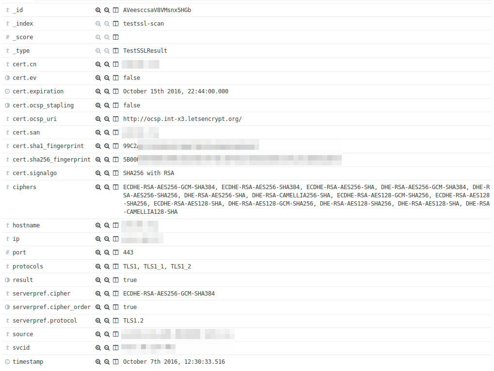
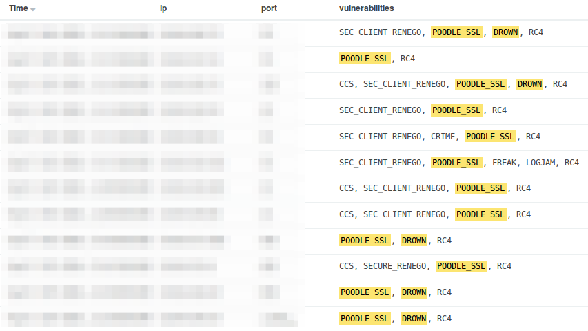
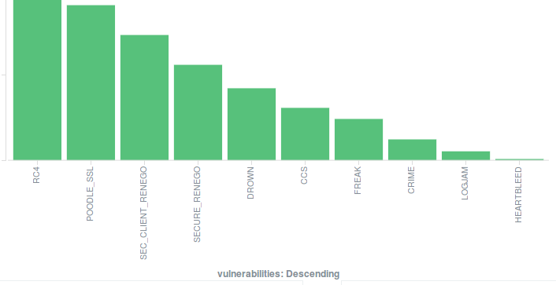
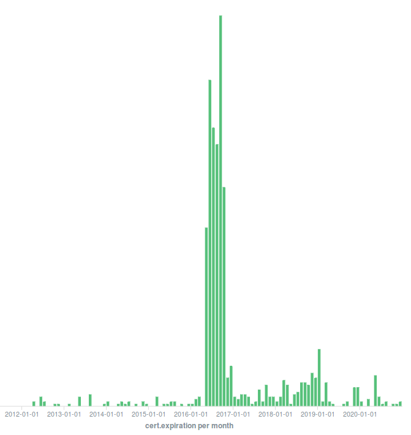

# Mass Scan Tools for testssl.sh

Script collection for generating [testssl.sh](https://testssl.sh/) command lines that can be executed sequentially or in
parallel with tools like [GNU Parallel](https://www.gnu.org/software/parallel/) and importing the results into a
structured document in [ElasticSearch](https://www.elastic.co/de/products/elasticsearch) for further analysis.

This is how the scan result of a service appears in Kibana:

Create vulnerability lists:

Visualize vulnerability distribution:

...or create vulnerability expiration graphs:

## Dependencies

* testssl.sh 2.9dev branch or later version
* Python 3 with following modules:
  * elasticsearch\_dsl
  * tzlocal

## Usage

1. Install dependencies (see above)
2. Create input file with one `host:port` pair per line.
3. Run `generate_scan_file.py inputfile > cmdfile` to generate file with testssl.sh command lines.
4. Run `parallel < cmdfile` to perform testssl.sh scans.
5. Run `import_testssl.sh_csv_to_ES.py *.csv` to import scan results into ElasticSearch.
6. View/Analyze data with [Kibana](https://www.elastic.co/de/products/kibana) or the tool of your choice.
7. Fix your TLS configurations :)
